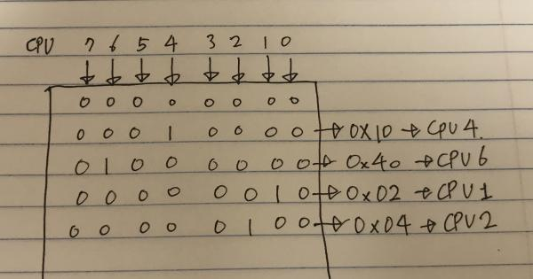
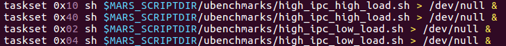
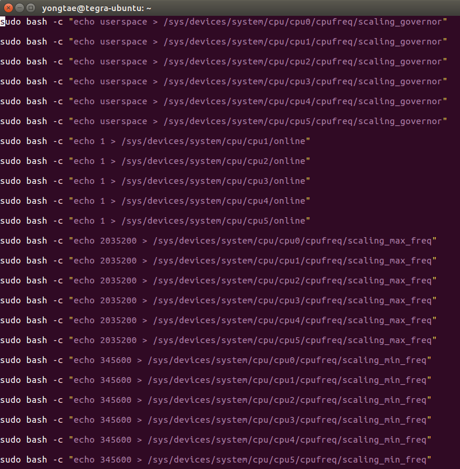
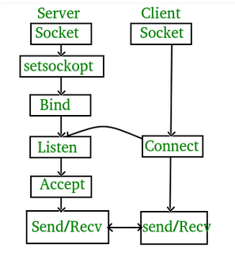
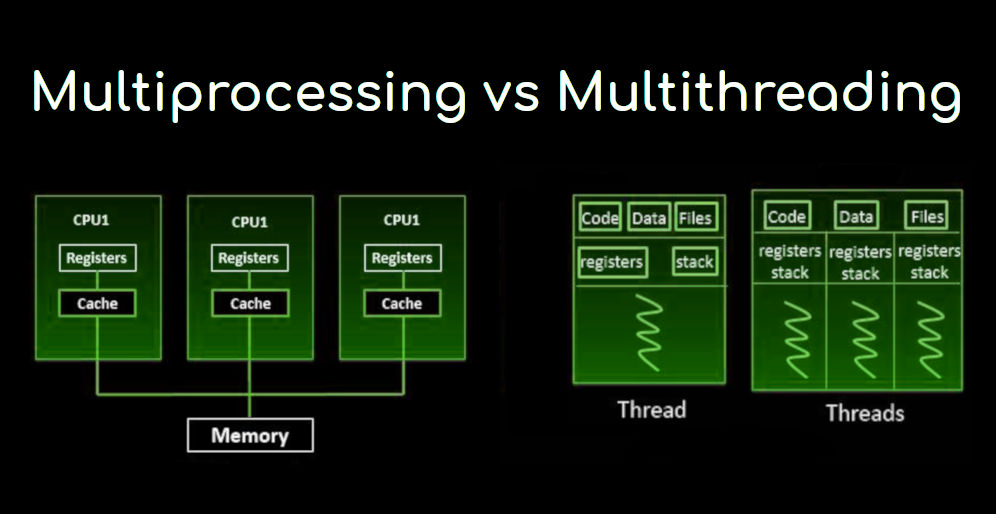

### Docker

Docker is a tool designed to make it easier to create, deploy, and run applications by using containers. 

Containers allow a developer to package up an application with all of the parts int needs, such as libraries and other dependencies, and ship it all out as on package. 

Docker is a bit like a virtual machine. But unlike a virtual machine, rather than creating a whole virtual operating system, Docker allows applications to use the same Linux kernel as the system that they're running on and only requires applications be shipped with things not already running on the host computer.

Image is a file, comprised of multiple layers, used to execute code in a Docker container. An image is essentially built from the instructions for a complete and executable version of an application, which relies on the host OS kernel.

reference(Korean) - https://subicura.com/2017/01/19/docker-guide-for-beginners-1.html


### Compiling

###### parameters

- ARCH : ISA used for compiling. Affects the GCC being used. Default is `ARCH=x86`if undefined

- PLAT : platform to use when compiling modules with platform-specific code. Set based on the value for ARCH if undefined. Ex: for odroid, `PLAT_DEFAULT_arm=exynos5422`
- CROSS_COMPILE_usr : Which GCC to use for user space applications. Set based on the value for ARCH if undefined
- CROSS_COMPILE_Krn : Which GCC to use for kernel modules. Set based on the value for ARCH if undefined.
- EXTRAFLAGS : Extra GCC options. Set based on the value for ARCH if undefined
- KERNEL_SRC : Path to kernel source used when compiling linux kernel modules. Set based on the value for ARCH if undifined.
- MODULE : Linux module to compile when running 'make exp_module'. No default value.
- UBENCH : Specify a specific target when running 'make ubench'
- DAEMONS : Specify specific daemons to build when running 'make daemons'. If blank all daemons are built. Use, "," to separate multiple values
- KERNEL_SRC_DEFAULT : Specify the kernel source code if cross compiling modules.


### Command `taskset`

Description : `taskset` is used to set or  retrieve the CPU affinity of a running process given its pid, or to launch a new command with a given CPU.

Synopsis : 

```
taskset [options] mask command [argument...]
taskset [options] -p [mask] pid
```

The masks may be specified in hexadecimal (with or without a leading "0x"), or as a CPU list with the --cpu-list option.  





In this cases, command `sh $MARS_SCRIPTDIR/ubenchmarks/high_ipc_high_load.sh > /dev/null &` processes on processor 4 and 6

And `sh $MARS_SCRIPTDIR/ubenchmarks/high_ipc_high_load.sh > /dev/null &` process on processor 1 and 2


### echo

echo command in linux is used to display line of text/string that are passed as an argument .



In this cases, `echo userspace > /sys/.../scaling_governor` means to modifying this file and controlling it in usersapce (cpu0~cpu5). 

`echo 1 > /sys/.../online` means on cpu(cpu1~cpu5)

And the others are to determine the maximum and minimum cpu frequency.


### dmseg -wH

dmesg is used to examine or control the kernel ring buffer. The default action is to display all messages from the kernel ring buffer.


### TCP/IP

TCP is one of the main protocols of the Internet protocol suite. TCP provides reliable, ordered, and error-checked delivery of a stream of octets between applications running on hosts communicating via an IP network.



This figure shows the form of a code that implements TCP.

Server source - https://github.com/yong4980/I-SURF-Project/blob/master/src/test_tcp_server.cpp

Client source - https://github.com/yong4980/I-SURF-Project/blob/master/src/test_tcp_client.cpp


### Multi-processing VS Multi-threading



##### Multi-processing

###### Definition 

- Multiprocessing sometimes refers to executing multiple processes(program) at the same time. It relates to the hardware (the CPU units) rather than the software (running processes). A system can be both multi-programmed by having multiple programs running at the same time and multiprocessing by having more than one physical processor.

###### Advantage 

- The multiprocessor system is to get more work done in a shorter period of time.

##### Multi-threading

###### Definition

- Multi-threading is an execution model that allows a single process to have multiple code segments(i.e., threads) run concurrently within the "context" of that process. You can think of threads as child processes that share the parent process resources but execute independently.

###### Advantage

- Less overhead to establish and terminate vs a process, because very little memory copying is required.
- Threads are faster to start than processes. And also faster for task-switching.


In this project, I used multi-processing. Because boards did not share resources.