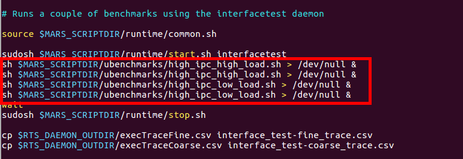

Use a 'Docker' to test in the Jetson TX2 board. 

1. Connect with a docker

   `sudo docker run -it duttresearchgroup/mars bash`

   

2. The default platform is set to exynos5422. We change some settings because we have to do it in the jetsontx2.

   Modify `vi .makefile.buildopts`

   

3. Build the binaries file. We run two commands. 

   `make runtime` , `make ubench`

4. It is time to deploy them on the target platform. The steps in this phase require bash shell. You can execute `ls -l /bin/sh` to verify if default shell points to `/bin/bash`.

5. Run `source scripts/env.sh` in the host machine.

   

6. Modify `scripts/confs.sh`. We change some settings exynos5422 -> jetsontx2.

   

7. Run `sh scripts/common/remote_synch.sh` to copy cross-compile binaries to the target.

8. Now, we work on target shell. Run `source scripts/env.sh` in the target platform.

9. Run `ls -l /bin/sh`

10. Run `source scripts/env.sh`

    

11. Modify `scripts/tests/interface_test.sh`. Delete `taskset`.

    

12. Run `sh scripts/tests/interface_test.sh`

    

*Notice

If you meet a segmentation error when testing, Run `source startup.sh`. I upload to git.