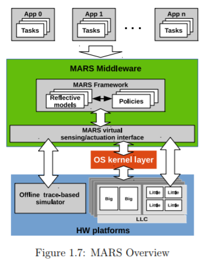
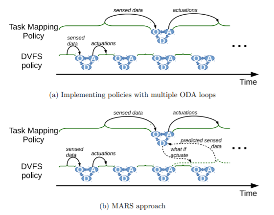

## A summary of Reflective On-Chip Resource Management Policies for Energy-Efficient Heterogeneous Multiprocessors

### chapter 1

Moore's law is coming to an end. Because the operating voltage has not been significantly decreasing, thus it's no longer possible to keep packing more transistors in the same chip area. ("power wall"). 

Heterogeneous processing elements extract more performance with a limited power envelope and avoid hitting the power wall.

GPUs consume low energy per calculation and are particularly energy efficient for applications with very high and regular parallelism.

* what is big.LITTLE? - big.LITTLE technology is a heterogeneous processing architecture that uses two types of processor. ”LITTLE” processors are designed for maximum power efficiency while ”big” processors are designed to provide maximum compute performance. With two dedicated processors, the big.LITTLE solution is able to adjust to the dynamic usage pattern for smartphones, tablets and other devices.

* what is HMP? - HMP is Heterogeneous Multi Processing

Important 2 questions

1. What is the most power efficient core type to execute the application without violating its performance requirements?
2. Which option is more power-efficient for the current application : an out-of-order core at a lower frequency an inorder core at a higher frequency?

* what is out-of-order core (OoO core)? - out-of-order execution (or more formally dynamic execution) is a paradigm used in most high-performance central processing units to make use of instruction cycles that would otherwise be wasted. In this paradigm, a processor executes instructions in an order governed by the availability of input data and execution units, rather than by their original order in a program. In doing so, the processor can avoid being idle while waiting for the preceding instruction to complete and can, in the meantime, process the next instructions that are able to run immediately and independently.

GTS(Global Task Scheduling) migrates tasks between high-performance and low-power core types when the task load reaches a certain threshold. But, this policy are customized for certain heterogeneous without being adaptable to other platforms. Furthermore, they exclusively focus on  task mapping/scheduling decisions and do not provide any coordination with the underlying power management subsystems.

Let's know a vision of a holistic approach for performing resource allocation decisions and power management by leveraging concepts from reflective software.

In this system, performing resource management actuation considering both sensing information to assess the current system state, as well as models to predict the outcome of the actuation before performing it.

### Chapter 2

* what is reflection? - A reflective system usually maintain a representation of itself within the underlying system, which is used for reasoning.

Notice : The reflection mechanisms used in these works impose a rather heavy workload that would cause significant performance deterioration in devices with limited resources and there is always a trade-off issue between performance and scope of adaptability.

MIMO(Multiple-Output Multiple-Input) is a robust solution and provides a systematic way incorporate new resources into the design. However, MIMO is not scalable[82] and cannot handle discrete system logic. 

* what is ODA? - all propose task mapping heuristics that use offline-trained models to predict the performance and/or power of a new task mapping based on current sensed data.
* what is the difference between Reflection and ODA? - In ODA decisions are made based either on past observation or predictions made from past observations. These predictions do not consider future action or events that could happen until the next iteration of the ODA loop. 

Self-adaptive software can be defined as "software that evaluates its own behavior and changes behavior when the evaluation indicates that it is not accomplishing what the software is intended to do, or when better functionality or performance is possible".

This thesis dose not address self-adaptive systems directly, but an infrastructure for system introspection and reflective behavior is an important building block for such systems, which highlights the potentials contributions of MARS in this context.

